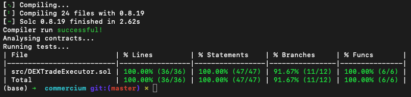

# Commercium

Smart Contract Trade Executor


## Installation

Install dependencies with [**Foundry**](https://github.com/gakonst/foundry):

```bash
  forge install
```
    
## Running Tests

The tests are ran agaisnt a fork of mainnet, as it allows us to skip manually setting up the DEX, pools, etc. We also set the block number as `17221955` as this allows us to test against a consistent chain state.

To run tests, run the following command

```bash
  forge test --rpc-url $MAINNET_RPC_URL --fork-block-number 17221955
```




